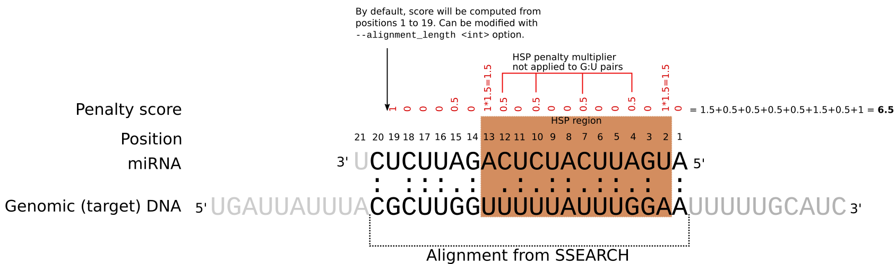

# MiRNATarget (aka psRNATarget_command_line)

This repository contains an implementation of the psRNATarget software (2018) (https://doi.org/10.1093/nar/gky316) for which there is a web service available here (http://plantgrn.noble.org/psRNATarget/). Using this web service is relevant for small datasets, but not for large datasets in the context of repeated usage by a bioinformatic production pipeline that can take full advantage of high performance computing capabilities. Unfortunately, no code is publicly available for that software and as such, no local implementation with custom databases is possible. psRNATarget in its current state (i.e. 2018 release) actually loosely describes an implementation of a 2011 previous psRNATarget release (https://doi.org/10.1093/nar/gkr319) which in turn refers to the Fahlgren & Carrington (2009) book chapter.



Here, we present code that implement the psRNATarget methodology. It parses the output of miRNA sequences aligned with SSEARCH against reference bacterial genomes. This script can be deployed and used on a HPC system. SSEARCH can be found in the fasta package (https://github.com/wrpearson/fasta36). Compared to the psRNATarget web server, this current implementation has the benefit of being fully customizable at the command line (see below for supported arguments) and does not give duplicate alignments in output.

The SSEARCH command used to align miRNA sequences is the following command inspired from TargetFinder (https://github.com/carringtonlab/TargetFinder) - look for line 243 of ```targetfinder.pl``` in particular. By trial and error, we've found the following ssearch commands to exactly reproduce the output of psRNATarget.

For forward strand alignment:
```
ssearch36 \
 -f -8 -g -3 -E 10000 -T 8 -b 200 -r +4/-3 -n -U -W 10 -N 20000 \
 <rev_comped_mirna_sequences> \
 <reference_db> \
 > <ssearch_output>
```

For reverse strand alignment:
```
ssearch36 \
-f -8 -g -3 -E 10000 -T 8 -b 200 -r +4/-3 -n -U -W 10 -N 20000 \
 <mirna_sequences> \
 <reference_db> \
 > <ssearch_output>
```
Note that in our tests, the ```-r``` argument had to be absolutely set to ```-r +4/-3```. The ```-f``` and ```-g``` parameters that were found to work are the following:
```-f -8 -g -3``` or ```-f -9 -g -2```.
Then convert the ssearch alignments to tsv format with ```parseSsearch.pl```
```
parseSsearch.pl \
  --infile ssearch_output.txt \
  > ssearch_output.tsv
```

Then, parse the alignments using the procedure implemented in psRNATarget:
```
parseMiRNATargets.pl --help
parseMiRNATargets.pl \
  --infile ssearch_output.tsv \
  > ssearch_output_parsed.tsv
```
You can also pipe the output of parseSsearch.pl into parseMiRNATargets.pl like this:
```
parseSsearch.pl --infile ssearch_output.txt | parseMiRNATargets.pl > ssearch_output_parsed.tsv
```

We compared the results of this script with the ones given by psRNATarget and it gives identical results. 

Available options of ```parseMiRNATargets.pl```:
```
INPUT:
--infile <string>                : Alignments in .tsv file format (output of companion script parseSsearch.pl). If no --infile <string> arg is 
                                   specified, will read from standard input.
--E_cutoff <float>               : default = 5.0  - Expectation value is the penalty for the mismatches 
                                   between mature small RNA and the target sequence. A higher value indicates 
                                   less similarity (and possibility) between small RNA and the target candidate. 
                                   The default penalty rule is set up by the scoring schema. Maximum expectation is the cutoff; 
                                   any small RNA-target pair with an expectation less than the cutoff will be discarded in the final result. 
                                   The recommended values are 3.0-5.0 depending on the scoring schema. 
--penalty_multiplier <string>    : default = 1.5. In the seed region (by default, 2-13 nt from the 5' of the miRNA strand), multiply mismatches by 
                                   penalty_multiplier. Only mismatches are multiplied, not G:U pairs and/or the '.' alignment
                                   caracters given by SSEARCH.
--hsp_start <int>                : default = 2 - Beginning of HSP region. --hsp_start and --hsp_end positions affect where in the alignment 
                                   the --penalty_multiplier will be applied.
--hsp_end <int>                  : default = 13 - End of HSP region.
--num_mismatch_seed <int>        : default = 2 - Maximum of allowed mismatches in the seed region, excluding G:U pairs.
--hsp_cutoff <int>               : default = 14 - HSPs shorter than this value will be discarded.
--gap_cutoff <int>               : default = 1 - alignments having more than <int> gaps willbe discarded.
--total_mismatches_cutoff <int>  : default = 8 - alignments showing more than <int> mismatches will be discarded.
--GUs_cutoff <int>               : default = 7 - alignments having more than <int> mismatches will be discarded.
--keep_target_suffix             : set flag if you wish to keep the temporary _<int> suffix appended at the end
                                   of subjects IDs.
--rev                            : Set flag if alignments of miRNAs were done on revcomp subject sequences.
--verbose                        : Set flag for debugging.
--maximum_alignment_length <int> : default = 22 - alignments longer than this value will be discarded.
--extra_penalty_query_gap <int>  : default = 1. If gap is located on query (miRNA) sequence, add an extra penalty of <int>.
--keep_tmp_file                  : Set flag if you wish to keep the tmp file resulting from the parsing of the ssearch file used as input.

OUTPUT:
STDOUT <string>                  : standard output. Alignments that passed filters.
--outfile_failed <string>        : stanbard error. Alignments that failed to pass filters.

```
## Note on G:U pairs
It might seem confusing that in Fig. 1, what is actually shown as A-G or C-U pairs are considered to be G:U mismatches. This is because the reverse complementary sequence is the one being used for computing the alignment, but the reverse sequence is the one that actually binds to its DNA target. For instance, in Fig. 1 at position 4, the 'A' nucleotide on the rev-comp sequence is a 'U' on the reverse sequence, hence resulting in a G:U pair. 
```
Input mirna sequence:           UACUAAGUAGAGUCUAAGAGA
Reverse sequence:               AGAGAAUCUGAGAUGAAUCAU <- Actual sequence that will bind to its target
Reverse complementary sequence: UCUCUUAGACUCUACUUAGUA <- miRNA sequence shown on Fig. 1
```

## Citation
If you use MiRNATarget in your work, please cite:

Tremblay, Julien

MiRNATarget 1.0 : miRNA target finder

https://github.com/jtremblay/mirnatarget
